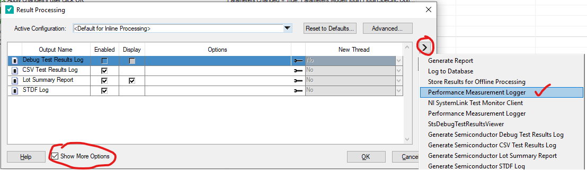
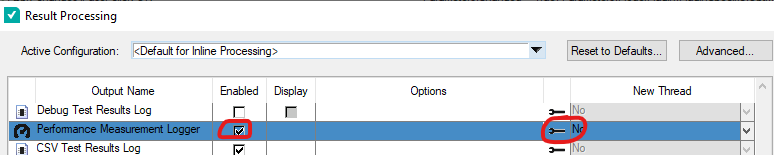
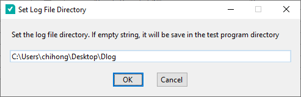

# TsmPerformanceLogger

Standalone Performance Measurement Logger model plugin modified from TestStand Semiconductor. As compared to the original, this logger is enabled from the Result Processing. So, it allows to log test time while handler is enabled. It also support to adjust batch sample rate so that the log file size is smaller.

## Environment

* TestStand 2021
* TestStand Semiconductor Module 2023 Q1

(Or STS Bundle 21)

## Install Method

Copy *Code/ModelPlugins* folder to *%teststandpublic64%/Components\Models* folder.

## Report Plugin Configuration

* Open the result processing dialog
  * If using TS Editor, go to menu >> Configure >> Result Processing
  * If using Operator Interface, go to Station Options >> Advance tab >> Result Processing
* Check the  **Show More Options** . Then click the ">" button and select "Performance Measurement Logger"

* Then, the Logger has been added to the report plugin list. Make sure the **Enabled** button is checked.

* By default, the location of the report will be saved in the test program sequence file folder. To change this, click the wrench symbol () to specify the location to save. 

* In the next dialog, user can specify the batch sample rate. So that it reduces the log file size if the logging performance or in-use memory is a concern. 

The generated report is a CSV. It can also be opened using the Test Program Performance Analyzer. 

